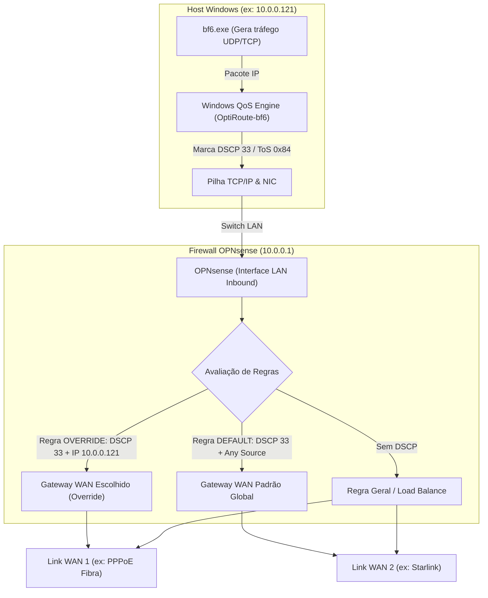
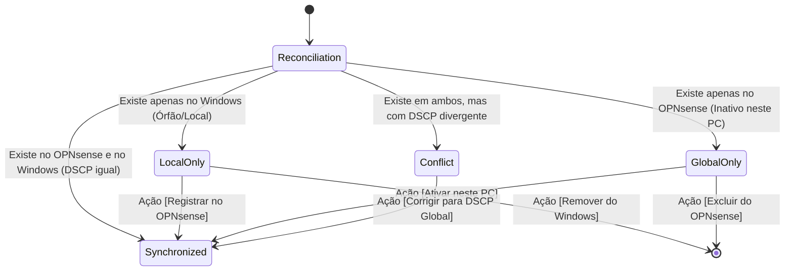

# Arquitetura do OptiRoute

## 1. Visão Geral

O **OptiRoute** é um orquestrador de políticas de rede para ambientes com múltiplos links de saída (Multi-WAN). Ele opera configurando políticas em dois níveis:

1. **No Sistema Operacional do Host (Windows):** Mapeia `Executável (.exe) → DSCP` via Policy-based QoS (`New-NetQosPolicy`).
2. **No Firewall de Borda (OPNsense):** Mapeia `DSCP (+ IP opcional) → Gateway WAN` via Firewall Rules na interface LAN.

O OptiRoute é projetado como um **executável desktop único (WPF em .NET 10)**, dispensando Windows Service, servidores web em localhost e portas abertas. As políticas configuradas no Windows e no firewall são persistentes.

---

## 2. O Princípio: DSCP como Identidade Global do Executável

Nas abordagens iniciais ou simples, cada valor DSCP costuma ser atrelado diretamente a uma WAN (ex: DSCP 33 = WAN 1, DSCP 34 = WAN 2). Esse modelo não escala quando múltiplos computadores precisam de configurações personalizadas e causa colisões de tráfego.

No OptiRoute:
- **O DSCP representa a identidade do aplicativo na rede inteira, de forma biunívoca:**
  - `bf6.exe` ↔ DSCP 33 (global)
  - `discord.exe` ↔ DSCP 34 (global)
  - `steam.exe` ↔ DSCP 35 (global)
- Quando um PC cadastra um novo executável, ele aloca um DSCP exclusivo a partir do `ManagedPool` (valores seguros, excluindo DSCP 0, 46 e classes AF/CS padrão).
- Uma vez registrado, **qualquer outro PC da rede** que ative aquele jogo utilizará o mesmo DSCP.

---

## 3. Topologia e Fluxo de Pacotes



---

## 4. OPNsense como Fonte Única da Verdade

O OptiRoute não utiliza banco de dados centralizado externo (Redis, PostgreSQL, etc.) nem arquivos compartilhados. O próprio conjunto de regras de firewall do OPNsense na categoria `OptiRoute` atua como o estado global sincronizado.

### 4.1 Tipos de Regras no OPNsense
Para cada aplicativo cadastrado, existem até dois tipos de regras:

1. **Regra `DEFAULT` (Global):**
   - **Descrição:** `OPTIROUTE|DEFAULT|<exe>|<dscp>|<appId>`
   - **Source:** `lan net` (ou `any`)
   - **DSCP:** Valor numérico do aplicativo
   - **Gateway:** WAN padrão definida para toda a rede.

2. **Regra `OVERRIDE` (Específica do Computador):**
   - **Descrição:** `OPTIROUTE|OVERRIDE|<exe>|<dscp>|<sourceIp>|<appId>`
   - **Source:** IP fixo ou estático do PC local (ex: `10.0.0.121`)
   - **DSCP:** Valor numérico do aplicativo
   - **Gateway:** WAN personalizada desejada para este computador.

### 4.2 Proteção Contra Sequestro de Serviços Locais
Para evitar que pacotes destinados ao próprio firewall (ex: consultas DNS no Unbound na porta 53, interface WebGUI ou SSH) sejam desviados para links externos, as regras de firewall do OptiRoute aplicam obrigatoriamente:
- `destination_net`: `"(self)"`
- `destination_not`: `"1"` (*Invert destination: ! Este firewall*)

### 4.3 Ordenação Relativa das Regras (`RuleOrderManager`)
O firewall avalia as regras de cima para baixo (*first match wins*). O OptiRoute garante a seguinte ordenação relativa sem modificar regras externas do usuário:

```text
[Regras Customizadas do Usuário - Topo]
         │
         ▼
[Regras OptiRoute - OVERRIDES (IP Específico)]
         │
         ▼
[Regras OptiRoute - DEFAULTS (LAN Geral)]
         │
         ▼
[Regra Âncora do Usuário (ex: LAN LOADBALANCE)]
         │
         ▼
[Regras Customizadas do Usuário - Base]
```

---

## 5. Reconciliação Bidirecional (4 Estados)

O OptiRoute realiza uma união real de estado entre o OPNsense e o Windows local:
$$\text{Aplicações} = \text{Regras OPNsense} \cup \text{Políticas Windows QoS}$$



### Estados de Sincronização:
1. **`Synchronized`:** Aplicativo perfeitamente integrado. Pode ter seu gateway padrão alterado ou um override local configurado.
2. **`LocalOnly`:** A política QoS existe no Windows local, mas não possui regra no OPNsense (ex: regras legadas de testes). O usuário pode promovê-la para regra global ou excluí-la do Windows. O OptiRoute **nunca** apaga políticas locais silenciosamente.
3. **`GlobalOnly`:** O jogo foi registrado por outro PC na rede e está disponível no firewall, mas ainda não foi ativado no Windows local. Um clique em `Ativar neste PC` configura o QoS local imediatamente.
4. **`Conflict`:** O DSCP configurado no Windows difere do DSCP global registrado no firewall. O botão `Corrigir para DSCP Global` alinha o valor local com o firewall.

---

## 6. Camadas da Solução (.NET 10)

```text
┌────────────────────────────────────────────────────────┐
│                      OptiRoute.App                     │
│  (Desktop WPF, Dark UI, MVVM, Admin Manifest UAC)      │
└───────────┬────────────────────────────────┬───────────┘
            │                                │
            ▼                                ▼
┌───────────────────────────┐    ┌───────────────────────┐
│      OptiRoute.Core       │    │   OptiRoute.Windows   │
│  - ApplicationIdentity    │    │  - WindowsQosManager  │
│  - DscpRegistry           │    │    (PowerShell QOS)   │
│  - OptiRouteSynchronizer  │    │  - SecretStore        │
│  - RuleOrderManager       │    │    (Windows DPAPI)    │
│  - HostOverrideManager    │    │  - KeyFileParser      │
└───────────┬───────────────┘    └───────────────────────┘
            │
            ▼
┌───────────────────────────┐
│     OptiRoute.OPNsense    │
│  - OpnsenseClient (REST)  │
│  - DTOs & Descriptors     │
│  - Gateway Status / PBR   │
└───────────────────────────┘
```

### Detalhamento dos Componentes:
- **`OptiRoute.Core`:** Contém toda a lógica agnóstica de plataforma: parsing de descritores estruturados (`OptiRouteRuleDescriptor`), alocação segura de DSCP (`DscpRegistry`), ordenação de regras (`RuleOrderManager`) e motor de reconciliação (`OptiRouteSynchronizer`).
- **`OptiRoute.OPNsense`:** Comunicação HTTP com o OPNsense via API REST (`/api/firewall/*`, `/api/routes/*`), suporte a autenticação por chave/segredo e tratamento de ToS hexadecimal (`0x84` = DSCP 33).
- **`OptiRoute.Windows`:** Interação nativa com o Windows PowerShell para criação (`New-NetQosPolicy`) e remoção (`Remove-NetQosPolicy`) de políticas de rede, além de armazenamento seguro de chaves com Windows DPAPI (`SecretStore`).
- **`OptiRoute.App`:** Aplicação desktop em WPF (.NET 10) com interface gráfica moderna, cartões reativos para os 4 estados, status de gateways em tempo real e controle de elevação UAC (`requireAdministrator`).
